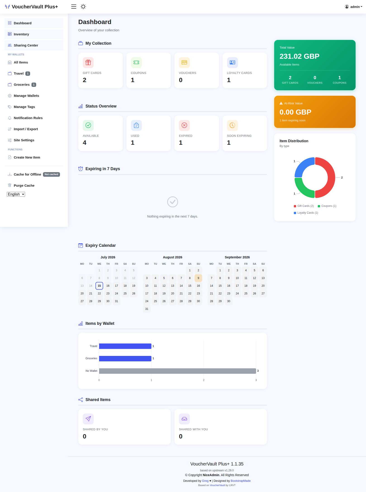
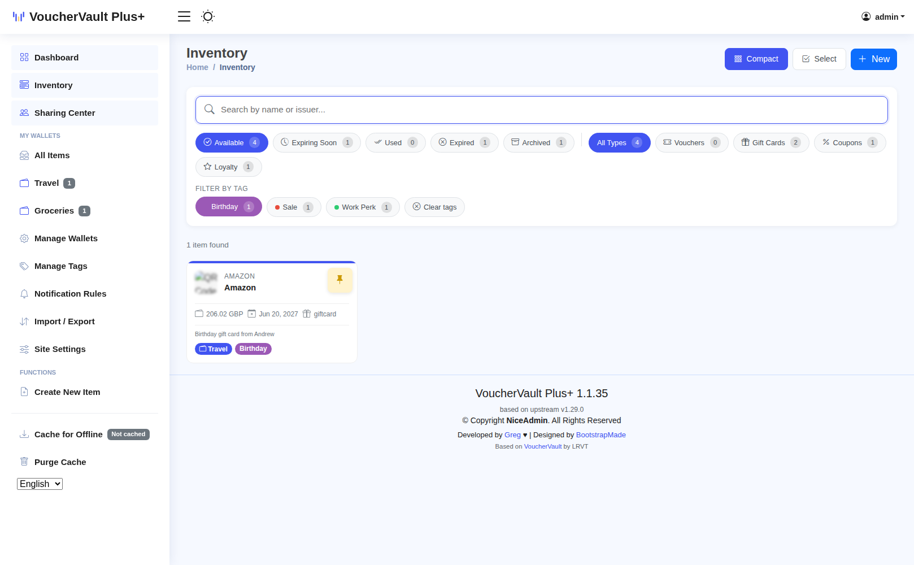
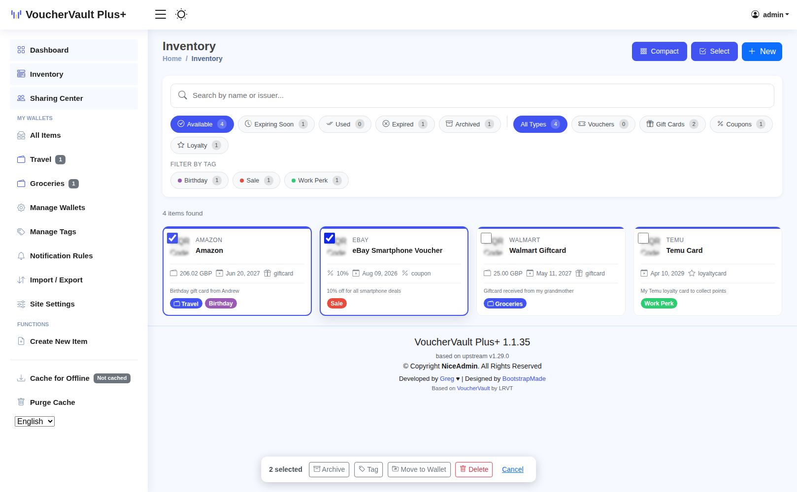
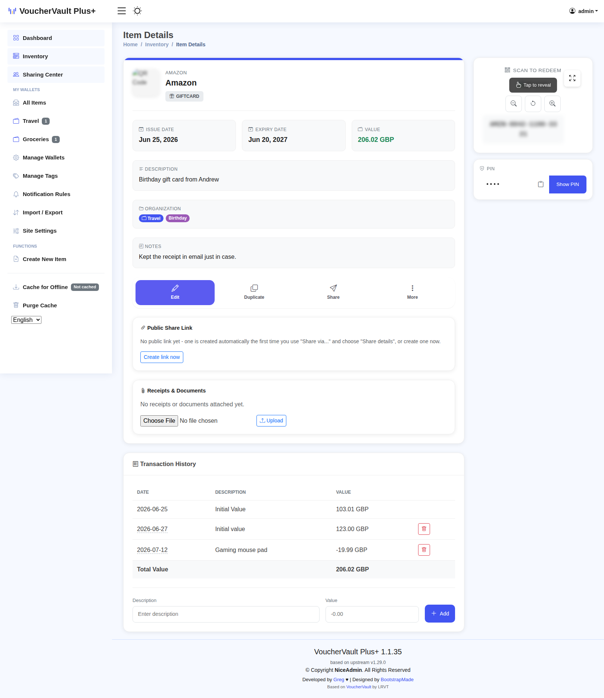
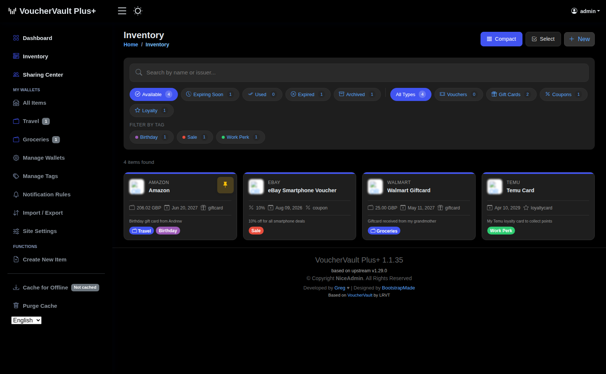
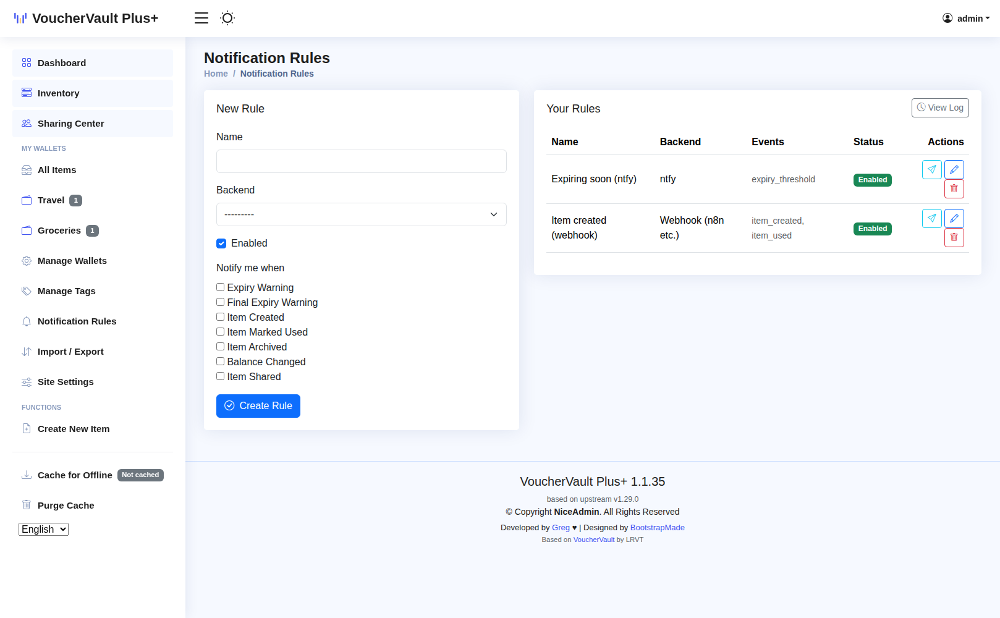
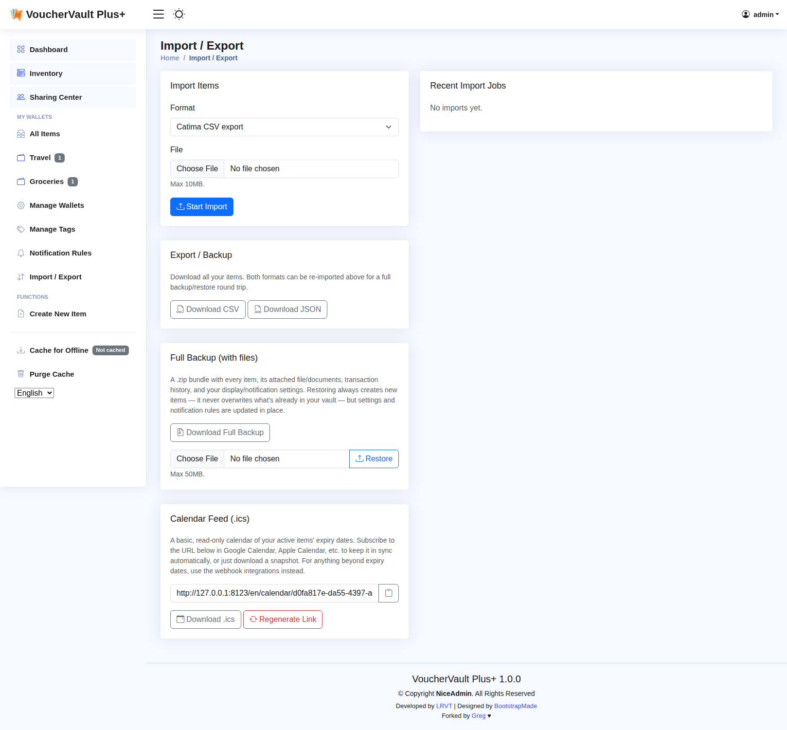
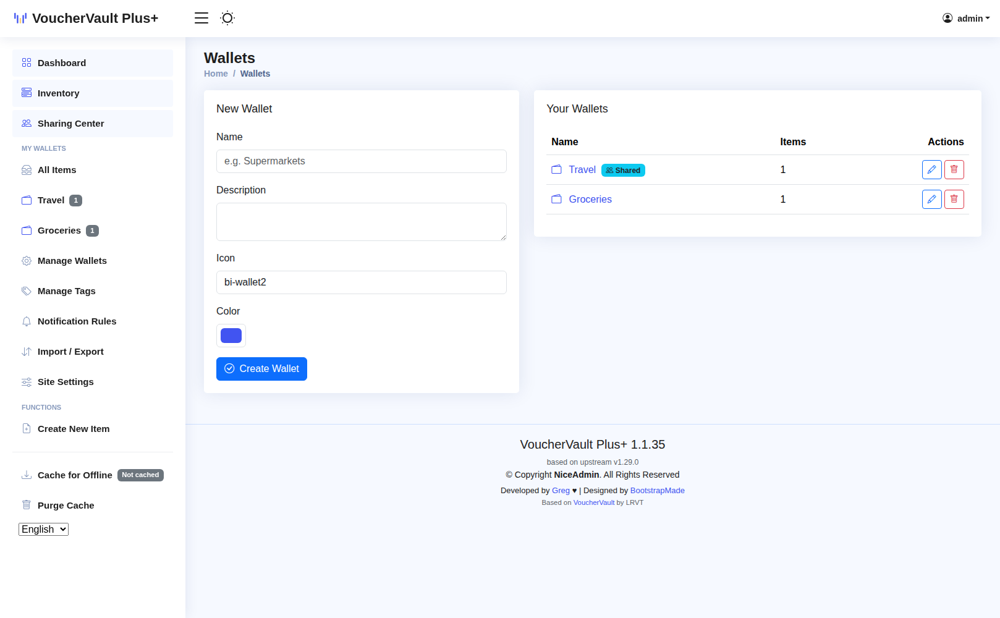
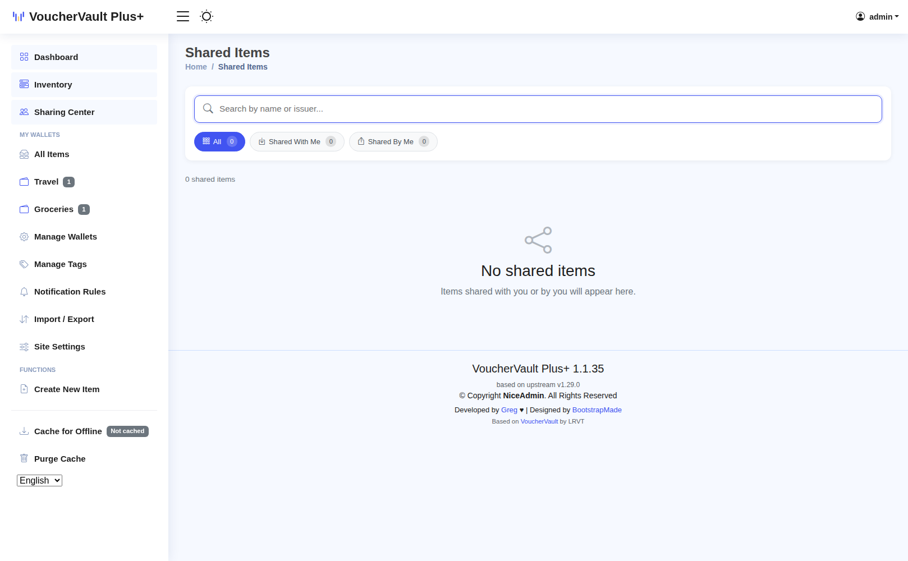

<div align="center" width="100%">
    <picture>
      <source media="(prefers-color-scheme: dark)" srcset="myapp/static/assets/img/logo-mono-white.svg">
      
    </picture>
    <h1>VoucherVault Plus+</h1>
    <p><strong>Store and manage vouchers, coupons, loyalty and gift cards — digitally, privately, on your own server.</strong></p>
    <p>
      <a target="_blank" href="https://github.com/gregbtm/VoucherVault/blob/main/LICENSE.md"></a>
      <a target="_blank" href="https://github.com/PyCQA/bandit"></a>
      <a target="_blank" href="https://github.com/gregbtm/VoucherVault/commits/"></a>
      <a target="_blank" href="https://github.com/gregbtm/VoucherVault/issues"></a>
      <a target="_blank" href="https://github.com/gregbtm/VoucherVault/stargazers"></a>
      <a target="_blank" href="https://github.com/gregbtm/VoucherVault/network/members"></a>
    </p>
    <p>
      
      
      
      
      
      
    </p>
</div>

> [!NOTE]
> **VoucherVault Plus+** is [gregbtm](https://github.com/gregbtm)'s fork of
> [l4rm4nd/VoucherVault](https://github.com/l4rm4nd/VoucherVault) — a
> mobile-optimized, installable PWA for storing vouchers, coupons, gift
> cards, and loyalty cards, with offline support, QR/barcode scanning,
> multi-user login with OIDC SSO, and Apprise expiry notifications out of
> the box (see [Features](#-features) for the complete original list).
>
> This fork is a strict superset: **94 rounds of work adding 436
> individual features and fixes** on top of upstream's own image, from a
> full REST API and AI-assisted scanning to shared wallets, digital
> wallet passes, and a rules-based notification engine — without
> touching a line of upstream's own code. See
> [What's New in This Fork](#-whats-new-in-this-fork) for the complete
> list, or jump to a [setup guide](#-setup-guides) for a specific
> integration.

## 📑 Table of Contents

- [Features](#-features)
- [What's New in This Fork](#-whats-new-in-this-fork)
- [Setup Guides](#-setup-guides)
- [Screenshots](#-screenshots)
- [Usage](#-usage)
- [Environment Variables](#-environment-variables)
- [Notifications](#-notifications)
- [Multi-User Setup](#-multi-user-setup)
- [Backups](#-backups)
- [About This Fork & Support](#-about-this-fork--support)

## ⭐ Features

- User-friendly, mobile-optimized web portal with PWA support
- Manual offline mode with 48h caching supported
- Light and dark theme support
- Integration of vouchers, coupons, gift cards and loyalty cards
- Transaction history tracking (gift cards only)
- Item-specific file uploads (images and PDFs)
- Item sharing between users
- Display of redeem codes as QR codes or barcodes (many types supported), or as plain text for cards with no scannable barcode at all
- Client-side redeem code scanning (1D/2D) during item creation with automatic type detection using camera or file upload
- Expiry notifications via Apprise
- Multi-user support
- Multi-language support (English, German, French, Italian)
- Single Sign-On (SSO) via OIDC
- Database compatibility with SQLite3 and PostgreSQL
- Multi-currency support via free fixer.io API

## 🚀 What's New in This Fork

Everything below is additive — nothing upstream was rewritten, so this
fork stays a strict superset and can be rebased against upstream at any
time. **9 categories, 60+ features** — click a section to expand it; the
full phase-by-phase technical changelog (root causes, code, tests,
commit links) lives in [`FORK_CHANGES.md`](FORK_CHANGES.md) if you want
the deep dive.

<details>
<summary><strong>🔌 API, Integrations & AI Assistants</strong></summary>

- **Full REST API** — token-authenticated CRUD for items, wallets, tags, transactions, webhooks, wallet memberships, and wallet activity, every endpoint scoped to the authenticated user. Interactive Swagger/OpenAPI docs live at `/api/v1/docs/` — browse and try every endpoint from your browser, no Postman required. Great for a Home Assistant sensor, a personal dashboard, or your own automation. Generate, regenerate, or revoke your own API token from **Profile menu → API Access** — no shell access needed.
- **MCP server** — a standalone, opt-in service exposing your vault to Claude Desktop, Claude Code, and other [MCP](https://modelcontextprotocol.io/) clients: search items, check what's expiring, log a gift-card spend, create items, manage wallets and tags, view webhook config, and browse the wallet activity audit log — all through your existing API token. See the [setup guide](docs/MCP_SERVER_SETUP.md).
- **Zero-code n8n integration** — the same OpenAPI schema that powers the Swagger docs plugs straight into n8n's HTTP Request Tool or AI Agent node, no custom node needed. See the [setup guide](docs/N8N_SETUP.md). A recipe for syncing gift card/voucher balances to a self-hosted [Firefly III](https://www.firefly-iii.org/) budget is also included — see [`docs/FIREFLY_III_SETUP.md`](docs/FIREFLY_III_SETUP.md).
- **Webhook lifecycle events** — item created, used, archived, balance changed, or shared, for wiring VoucherVault into n8n, Home Assistant, or anything else that speaks webhooks.
- Rate limiting on every API write endpoint.

</details>

<details>
<summary><strong>🤖 AI-Assisted "Scan with AI" & Smart Barcode Detection</strong></summary>

Stop retyping redeem codes off a photo. Upload a picture of a physical
voucher, coupon, or gift card — or a screenshot of an emailed gift card,
a retailer app screen, or a digital wallet pass — and let it pre-fill the
form for you. One upload does two things at once: a real client-side
barcode/QR decode (ground truth) and an AI read of the text fields, with
the decoded barcode always winning over the AI's guess when both are
available.

- **Three backends, your choice**: **Claude** or **OpenAI** (vision models — code, merchant, issuer, expiry, PIN, value, currency, card number) or **Tesseract** (100% free, fully local, code-only, no API key). See the [setup guide](docs/OCR_SETUP.md).
- **Brand-aware logo extraction** — a reseller's card gets the actual brand's logo, not the reseller's, and a printed balance-check URL is pulled straight off the card if there is one.
- **Live duplicate detection** as you scan or type — a code match, a photo-hash match (catches "I scanned this exact card twice" even if OCR reads it slightly differently each time), and a fuzzy near-match warning for a code that's suspiciously close to one you already have. All friendly warnings, never a hard block.
- **Confidence warnings** — the AI re-verifies its own code read character-by-character, and a low-confidence or easily-confused read (0/O, 1/I/l) shows a visible "double-check this" flag.
- Every auto-filled field is visibly highlighted until you've reviewed it; editing an existing item's code never gets silently clobbered by a rescan.
- **Issuer autocomplete** and a one-click **Swap Name/Issuer** button for when a scan gets the two backwards.
- **16 barcode symbologies with smart auto-detection** — the code type is auto-selected from what was actually decoded, never left as a guess you have to make yourself.
- **"No Barcode" code type** for gift cards that are just a printed number with nothing to scan.
- Processed synchronously, nothing persisted server-side beyond the item's own attached image.

</details>

<details>
<summary><strong>🗂️ Organization — Wallets, Tags, Notes & Bulk Actions</strong></summary>

- **Wallets** — named folders ("Travel", "Groceries", "Kids' Cards") to group items however makes sense to you.
- **Tags** — free-form, colour-coded labels, many-to-many with items, with a clickable filter chip row (live counts!) above the Inventory grid.
- **Notes** — a free-text field on every item for anything the built-in fields don't capture.
- **Shared wallets** — invite another user by username to collaborate, with a **viewer or editor role**: editors can create, edit, and delete items; viewers can only read. Both roles can see everything inside the wallet, no admin access required.
- **Archiving** — retire an item without deleting it, and **last-used tracking** for a real "most recently used" sort.
- **Bulk actions** — a checkbox select mode with a sticky action bar for archiving, tagging, moving to a wallet, or deleting several items at once.
- **Card number vs. barcode payload** — a separate field for when a printed member number differs from what's actually encoded in the barcode.
- **Gift-card balance-check link** — a bookmarked link per merchant, remembered and auto-suggested on future cards from the same issuer, with a one-tap "Check Balance" button.
- **"Next Up" widget** — point it at one or more wallets (e.g. "Train Tickets") and Inventory highlights a queue of the soonest-expiring items across them (up to 3, configurable), barcode included, ready to scan, with a one-tap "mark as used" on each card. Off by default; opt in from Preferences. Pair it with a "Next Up Item Due Today" notification rule for a same-day reminder.
- **"Active Today" widget** — built for a daily round-trip ticket (e.g. a train commute): before your configured cutoff time it shows today's outward leg, then automatically switches to the return leg after it, only ever on the day the ticket is actually valid for. Set a home station in Preferences and tag a ticket's Journey From/To fields (auto-filled by "Scan with AI" for a photographed train ticket) to use it. Off by default.
- **"Nearby" widget** (opt-in) — a one-shot location check on Inventory load: if a shop near you (via OpenStreetMap, free and no API key) matches one of your item issuers, it surfaces in a "Nearby" card — walk into Tesco and see your Tesco gift card without searching for it. Never watches your location continuously and never stores your coordinates.
- **"Travel Pass" item type** — a purpose-built layout for train/transport tickets: Journey From/To and an optional Time of Travel, with Value, Currency, Card Number, and PIN all hidden since they don't apply. Issue Date falls back to the expiry date when left blank (many tickets are valid and expire same-day), and every item of this type is filed straight into a "Travel Pass" wallet automatically.
- **PDF eTicket import (UK rail)** — "Scan with AI" also accepts a PDF eTicket, not just photos: the Aztec barcode UK rail tickets use is decoded server-side and the journey/price fields pre-filled, ready to review and save. The same endpoint powers a fully unattended n8n workflow that watches an inbox for booking confirmation emails and creates the Travel Pass item automatically — see [`docs/RAIL_TICKET_IMPORT_SETUP.md`](docs/RAIL_TICKET_IMPORT_SETUP.md).
- **Auto-assign new items to a wallet by issuer** — set a wallet's "auto-assign" match text (e.g. "National Rail") and any new item whose issuer contains it — scanned or typed — is filed straight into that wallet unless you pick one yourself.
- **Auto-suggest from recent activity** — after "Scan with AI" fills in what it could read from a photo, any of Issuer, Logo, Wallet, or Currency it left blank get suggested from your habits: the issuer you use most across your last 10 items of that type, with the companion fields taken from your newest matching item. Suggestions wear their own dashed-amber styling so they're never mistaken for values read off the photo. Manual entry (no photo scan) is never auto-suggested.
- **Self-learning scans** — correct a scan's mistake once (a misread operator name, an Aztec code labelled as QR, a blank field you always fill the same way) and it's remembered per-user and silently fixed on every future scan, flagged with a "learned from your past corrections" chip. Keep a scanned value as-is and any stale correction for it is retired automatically.

</details>

<details>
<summary><strong>🔔 Notifications & Automation</strong></summary>

The original Apprise-only expiry check still works exactly as before —
this adds a second, more flexible layer covering the item's whole
lifecycle.

- **Rules-based engine** with three extra delivery backends beyond Apprise: [ntfy](https://ntfy.sh), a generic **webhook**, and native browser/OS **Web Push** (opt-in, requires VAPID keys — generate a pair with one command, no third-party relay needed).
- **Per-item thresholds** — one item can warn 60 days out, another only 7, plus a final reminder as the deadline gets close.
- Rules can also fire on item created, used, archived, balance changed, or shared — not just expiry.
- **Daily digest mode** — batch a rule's notifications into a single once-a-day summary instead of one push per event, for a rule covering a busy wallet.
- A complete **delivery log** so you can see exactly what fired, when, and whether it succeeded.
- Managed entirely from the web UI, no config file editing.

</details>

<details>
<summary><strong>🍏🟢 Digital Wallet Passes</strong></summary>

- **Apple Wallet** — download a signed `.pkpass` for any item, or go the other way and pre-fill a new item by uploading an existing pass. Export needs your own Apple Developer certificate (see the [setup guide](docs/APPLE_WALLET_SETUP.md)); import needs no setup at all.
- **Google Wallet** — a one-tap "Add to Google Wallet" link, set up once by whoever runs the container (see the [setup guide](docs/GOOGLE_WALLET_SETUP.md)). Passes **update live** — editing the item's balance or details pushes the change straight to an already-issued pass, not just a snapshot frozen at export time.
- The item detail page shows only the button your current device can actually use — Apple on Safari/iOS, Google on Android/Chromium — never a dead link.

</details>

<details>
<summary><strong>📤 Sharing, Public Links & Merchant Branding</strong></summary>

- **Share content into VoucherVault** — VoucherVault registers as a target in your device's native share sheet (PWA Web Share Target API). Share a retailer page, a confirmation email, or any URL from your browser or another app and it opens the "Add Item" form with the title and URL pre-filled, ready to review and save. Works on Android and desktop Chromium whenever the PWA is installed.
- **Native OS/browser sharing** — a "Share via…" button hands an item off to your device's real share sheet (Messages, Mail, AirDrop, etc.), with a clipboard-copy fallback on desktop, and a choice between a bare link or one that also includes the code/PIN/balance.
- A **no-login-required public link** — works for someone with zero VoucherVault account, with view tracking and regenerate/revoke controls. Links auto-expire (configurable), rate-limit repeat requests, and can optionally require an access PIN.
- Real **merchant brand logos** in link previews on WhatsApp/iMessage/Slack — not a generic icon — without ever exposing the code/PIN/balance to that app's preview crawler.
- The public link page offers an "Add to Wallet" button for whichever of Apple/Google Wallet is both configured and usable on the recipient's device.

</details>

<details>
<summary><strong>📊 Analytics, Import & Backup</strong></summary>

- **Analytics dashboard** — KPI tiles, an expiry calendar heatmap, and a live "value at risk" figure so nothing quietly expires unnoticed.
- **Import** from a [Catima](https://catima.app/) CSV export, an existing Apple Wallet `.pkpass`, or this app's own CSV/JSON — background-processed with per-row error reporting, so one bad row doesn't sink the rest.
- **Export** to CSV/JSON any time, or a **Full Backup (with files)** — a `.zip` bundling every item, its attached files, transaction history, and account settings, for a restore that doesn't lose anything the text-only formats can't carry.
- A **nightly scheduled backup** (opt-out) runs the same Full Backup format automatically with rotation. See [`docs/BACKUP_RESTORE.md`](docs/BACKUP_RESTORE.md).
- A subscribe-able **.ics calendar feed** of your active items' expiry dates for Google Calendar, Apple Calendar, etc. — each event carries the wallet as its location, tags as categories, a link back to the item, and a built-in reminder alarm matching your notification threshold. Never includes the redeem code, PIN, or card number, since a subscribed feed typically syncs to your calendar provider's own cloud.

</details>

<details>
<summary><strong>🎨 Design & Everyday Polish</strong></summary>

- **True-black OLED dark theme** — an extra toggle on top of the regular light/dark theme, for phones with an OLED/AMOLED screen.
- **Barcode zoom** — pinch or on-screen +/− controls for codes that scan poorly at the default size.
- **Screen wake lock** — the screen stays on while a barcode is shown to a cashier.
- A configurable **code-blur toggle** for privacy in public — hides just the barcode/QR image behind a tap-to-reveal, never the code text itself, which stays legible so it can always be tapped to copy.
- **Tap the redeem code or card number anywhere to copy it** — no separate copy button to hunt for; a long code clips to a few lines with a "Show full code" toggle instead of stretching the page.
- **View original uploads and attached documents inline** — a "View" button opens an image or PDF in a fullscreen overlay, no download required just to check what you scanned.
- **Tilt-to-scan detection** (opt-in) — tilt your phone forward to present a barcode to a reader (train barriers, a till scanner) and a dismissible "Mark Used?" prompt appears on its own; it only ever suggests, never marks an item used without an explicit tap.
- Floating toast messages instead of a page-top banner.
- **Smooth, modern animations everywhere** — staggered fade-up entrances on cards, form sections, and widgets (powered by the self-hosted [Motion](https://motion.dev) library, hardware-accelerated so it stays fluid on low-end phones), pop-in toasts and chips, and tactile press feedback on buttons. Fully respects your OS's reduced-motion setting.
- **A modern color picker** for wallet, tag, and item-tile colours — a curated swatch grid plus a hex field, replacing the jarring native browser/OS colour picker `<input type="color">` otherwise falls back to.

</details>

<details>
<summary><strong>⚙️ Admin, Deployment & Reliability</strong></summary>

- **In-app Site Settings page** — every app-level setting (OCR backend and API keys, Apple/Google Wallet config, notification defaults, backup schedule, and more) is editable from a superuser-only page in the app itself, not just Portainer environment variables. Changes apply immediately, no redeploy needed. Secret fields never round-trip back into the page — they show a "currently set" hint instead of the actual value.
- **Update-available banner + one-click redeploy** — a periodic, opt-out check against this repo's GitHub Releases surfaces a "new version available" banner to admins. If you're running this as a git-based Portainer stack, an optional webhook adds a "Redeploy now" button, plus a companion GitHub Action that can trigger the same webhook automatically on every push to `main`. See [`docs/AUTO_DEPLOY.md`](docs/AUTO_DEPLOY.md).
- **Upstream sync tracking** — see how far behind upstream's latest release this install is, right from Site Settings.
- Production error logging, so an unhandled exception doesn't just vanish silently.
- GBP as the default currency for new items and preferences.
- **TOTP two-factor authentication** — each user can enrol a TOTP authenticator app (Google Authenticator, Authy, etc.) from their **Profile → Security** page. On enrolment, eight single-use backup/recovery codes are shown once for safe offline storage. Session Management lists every active login, device type, and browser, with a one-tap "Sign out everywhere" — useful when you've lost a device. 2FA can be disabled by the user themselves, or by an admin via the Django admin panel.
- **Login brute-force lockout** — locks an account out after repeated failed login attempts ([django-axes](https://github.com/jazzband/django-axes)), configurable via `AXES_FAILURE_LIMIT`/`AXES_COOLOFF_TIME_HOURS`. Locks by username rather than IP, so one attacker on a shared/CGNAT network can't lock out everyone behind the same address.

</details>

## 📚 Setup Guides

A handful of features need a one-time setup by whoever runs the container
— not something each person using your instance has to do themselves:

- [`docs/OCR_SETUP.md`](docs/OCR_SETUP.md) — enabling "Scan with AI" (Claude, OpenAI, or free local Tesseract)
- [`docs/APPLE_WALLET_SETUP.md`](docs/APPLE_WALLET_SETUP.md) — Apple Wallet export
- [`docs/GOOGLE_WALLET_SETUP.md`](docs/GOOGLE_WALLET_SETUP.md) — Google Wallet export
- [`docs/MCP_SERVER_SETUP.md`](docs/MCP_SERVER_SETUP.md) — wiring up an AI assistant
- [`docs/N8N_SETUP.md`](docs/N8N_SETUP.md) — connecting n8n to the REST API
- [`docs/FIREFLY_III_SETUP.md`](docs/FIREFLY_III_SETUP.md) — syncing gift card/voucher balances to Firefly III via n8n
- [`docs/RAIL_TICKET_IMPORT_SETUP.md`](docs/RAIL_TICKET_IMPORT_SETUP.md) — auto-importing UK rail eTickets from email via n8n
- [`docs/AUTO_DEPLOY.md`](docs/AUTO_DEPLOY.md) — one-click redeploy on every push to `main`
- [`docs/BACKUP_RESTORE.md`](docs/BACKUP_RESTORE.md) — how scheduled backups work and how to restore one
- [`docs/UPGRADE.md`](docs/UPGRADE.md) — already running the upstream Docker image? Switching to this fork
- Site Settings also has a "?" help button next to every integration that needs its own setup, opening the relevant guide in-app.

## 📷 Screenshots

<details open>
<summary><strong>Analytics dashboard</strong> — KPI tiles, at-risk value, item distribution, expiry calendar heatmap</summary>

</details>

<details>
<summary><strong>Inventory</strong> — status/type filters, the clickable tag filter, wallet badges</summary>

</details>

<details>
<summary><strong>Bulk actions</strong> — checkbox select mode with the sticky action bar</summary>

</details>

<details>
<summary><strong>Item Details</strong> — tags/notes/wallet, document attachments, transaction ledger</summary>

</details>

<details>
<summary><strong>True-black OLED dark theme</strong></summary>

</details>

<details>
<summary><strong>Notification Rules</strong> — ntfy/webhook/Apprise/Web Push, per-item event types</summary>

</details>

<details>
<summary><strong>Import / Export</strong> — CSV/JSON, Full Backup, and the .ics calendar feed</summary>

</details>

<details>
<summary><strong>Wallets</strong> — grouping items, sharing a wallet with another user</summary>

</details>

<details>
<summary><strong>Sharing Center</strong> — items shared with you and by you</summary>

</details>

## 🐳 Usage

For installation and Docker Compose setup, see the upstream wiki (still
accurate — this fork doesn't change how the container itself is deployed):
[READ THE WIKI](https://github.com/l4rm4nd/VoucherVault/wiki/01-%E2%80%90-Installation) - [UNRAID SUPPORTED](https://github.com/l4rm4nd/VoucherVault/wiki/01-%E2%80%90-Installation#unraid-installation)

For this fork's own feature guides, see
[this fork's wiki](https://github.com/gregbtm/VoucherVault/wiki).

````
# create volume dir for persistence
mkdir -p ./volume-data/database

# adjust volume ownership to www-data
sudo chown -R 33:33 volume-data/*

# spawn the container stack
docker compose -f docker/docker-compose-sqlite.yml up -d
````

Once the container is up and running, you can access the web portal at http://127.0.0.1:8000. 

The default username is `admin`. The default password is auto-generated. You can obtain the auto-generated password via the Docker container logs:

````
docker compose -f docker/docker-compose-sqlite.yml logs -f
````

> [!WARNING]
> The container runs as low-privileged `www-data` user with UID/GID `33`. So you have to adjust the permissions for the persistent database bind mount volume. A command like `sudo chown -R 33:33 <path-to-volume-data-dir>` should work. Afterwards, please restart the container.

> [!TIP]
> This fork doesn't publish its own Docker Hub image — deploy it as a
> git-based Portainer stack that builds `docker/Dockerfile` straight from
> this repo (see [`docs/UPGRADE.md`](docs/UPGRADE.md) if you're moving
> over from upstream's published image). The in-app update banner and
> one-click [redeploy button](docs/AUTO_DEPLOY.md) track new commits on
> `main` for you, so there's no image tag to pin or track manually.

## 🌍 Environment Variables

The docker container takes various environment variables. **Most of the
app-level ones below (everything except domain/database/session/SSO
settings) can also be configured from the in-app Site Settings page**
(`/admin-tools/site-settings/`, superuser-only, linked from the sidebar)
instead — changes there take effect immediately, no redeploy required,
and are stored in the database rather than the container's environment.
The env vars below are what a fresh install starts from; once you've
edited a setting in Site Settings, that's the value that's actually used.

<details>
<summary><strong>Show all environment variables</strong> (55 total — domain/database/session/SSO plus every app-level default)</summary>

| Variable                         | Description                                                                                                     | Default                    | Optional/Mandatory  |
|----------------------------------|-----------------------------------------------------------------------------------------------------------------|----------------------------|---------------------|
| `DOMAIN`                         | Your Fully Qualified Domain Name (FQDN) or IP address. Used to define `ALLOWED_HOSTS` and `CSRF_TRUSTED_ORIGINS` for the Django framework. May define multiple ones by using a comma as delimiter. | `localhost` | Mandatory           |
| `SECURE_COOKIES`                 | Set to `True` if you use a reverse proxy with TLS. Enables the `secure` cookie flag and `HSTS` HTTP response header. | `False`               | Optional            |
| `SESSION_EXPIRE_AT_BROWSER_CLOSE`| Set to `False` if you want to keep sessions valid after browser close.                                          | `True`                     | Optional            |
| `SESSION_COOKIE_AGE`             | Define the maximum cookie age in minutes.                                                                       | `30`                       | Optional            |
| `EXPIRY_THRESHOLD_DAYS`          | Defines the days prior item expiry when an Apprise expiry notification should be sent out.                      | `30`                       | Optional            |
| `EXPIRY_LAST_NOTIFICATION_DAYS`          | Defines the days prior item expiry when another final Apprise expiry notification should be sent out.                      | `7`                       | Optional            |
| `TZ`                             | Defines the `TIME_ZONE` variable in Django's settings.py.                                                       | `Europe/Berlin`            | Optional            |
| `SECRET_KEY`                     | Defines a fixed secret key for the Django framework. If missing, a secure secret is auto-generated on the server-side each time the container starts. | `<auto-generated>`         | Optional            |
| `PORT`                           | Defines a custom port. Used to set `CSRF_TRUSTED_ORIGINS` in conjunction with the `DOMAIN` environment variable for the Django framework. Only necessary, if VoucherVault is operated on a different port than `8000`, `80` or `443`. | `8000`                     | Optional            |
| `REDIS_URL`                      | Defines the Redis URL to use for Django-Celery-Beat task processing.                                            | `redis://redis:6379/0`     | Optional            |
| `CSP_FRAME_ANCESTORS`            | Comma-separated list of allowed sources for the CSP `frame-ancestors` directive.                                | `'none'`                   | Optional            |
| `OIDC_ENABLED`                   | Set to `True` to enable OIDC authentication.                                                                    | `False`                    | Optional            |
| `OIDC_AUTOLOGIN`                 | Set to `True` if you want to automatically trigger OIDC flow on login page                                      | `False`                    | Optional            |
| `OIDC_CREATE_USER`               | Set to `True` to allow the creation of new users through OIDC.                                                  | `True`                     | Optional            |
| `OIDC_RP_SIGN_ALGO`              | The signing algorithm used by the OIDC provider (e.g., RS256, HS256).                                           | `HS256`                    | Optional            |
| `OIDC_OP_JWKS_ENDPOINT`          | URL of the JWKS endpoint for the OIDC provider. Mandatory if `RS256` signing algo is used.                      | `None`                     | Optional            |
| `OIDC_RP_CLIENT_ID`              | Client ID for your OIDC RP.                                                                                     | `None`                     | Optional            |
| `OIDC_RP_CLIENT_SECRET`          | Client secret for your OIDC RP.                                                                                 | `None`                     | Optional            |
| `OIDC_OP_AUTHORIZATION_ENDPOINT` | Authorization endpoint URL of the OIDC provider.                                                                | `None`                     | Optional            |
| `OIDC_OP_TOKEN_ENDPOINT`         | Token endpoint URL of the OIDC provider.                                                                        | `None`                     | Optional            |
| `OIDC_OP_USER_ENDPOINT`          | User info endpoint URL of the OIDC provider.                                                                    | `None`                     | Optional            |
| `DB_ENGINE`                      | Database engine to use (e.g., `postgres` for PostgreSQL or `sqlite3` for SQLite3).                              | `sqlite3`                  | Optional            |
| `POSTGRES_HOST`                  | Hostname for the PostgreSQL database.                                                                           | `db`                       | Optional            |
| `POSTGRES_PORT`                  | Port number for the PostgreSQL database.                                                                        | `5432`                     | Optional            |
| `POSTGRES_USER`                  | PostgreSQL database user.                                                                                       | `vouchervault`             | Optional            |
| `POSTGRES_PASSWORD`              | PostgreSQL database password.                                                                                   | `vouchervault`             | Optional            |
| `POSTGRES_DB`                    | PostgreSQL database name.                                                                                       | `vouchervault`             | Optional            |
| `CELERY_WORKER_CONCURRENCY`           | Celery worker concurrency.                                                                                 | `1`                        | Optional            |
| `CELERY_WORKER_PREFETCH_MULTIPLIER`   | Celery worker prefetch multiplier.                                                                         | `1`                        | Optional            |
| `DEBUG`                           | Enable HTTP debug logging.                                                                                     | `False`                    | Optional            |
| `NTFY_DEFAULT_SERVER`             | Default ntfy server pre-filled when a user creates a new ntfy notification rule.                               | `https://ntfy.sh`          | Optional            |
| `MERCHANT_LOGOS_ENABLED`          | Set to `False` to disable auto-fetching merchant logos on item cards.                                          | `True`                     | Optional            |
| `OCR_BACKEND`                     | Set to `claude`, `openai`, or `tesseract` to enable the "Scan with AI" button on the item form.                | `none`                     | Optional            |
| `ANTHROPIC_API_KEY`               | Required if `OCR_BACKEND=claude`. Get one at [console.anthropic.com](https://console.anthropic.com/).          | `None`                     | Optional            |
| `ANTHROPIC_OCR_MODEL`             | Overrides the Claude model used for OCR extraction.                                                            | `claude-sonnet-5`          | Optional            |
| `OPENAI_API_KEY`                  | Required if `OCR_BACKEND=openai`. Get one at [platform.openai.com](https://platform.openai.com/api-keys).      | `None`                     | Optional            |
| `OPENAI_OCR_MODEL`                | Overrides the OpenAI model used for OCR extraction. `gpt-4o-mini` is the cost-efficient default; a full-tier vision model reads small print (expiry dates, long codes) noticeably more reliably if accuracy matters more than cost. | `gpt-4o-mini`              | Optional            |
| `SCHEDULED_BACKUP_ENABLED`        | Set to `False` to disable the nightly local backup task. See [`docs/BACKUP_RESTORE.md`](docs/BACKUP_RESTORE.md). | `True`                     | Optional            |
| `BACKUP_RETENTION_COUNT`          | How many backups to keep per user before rotating out the oldest.                                              | `7`                        | Optional            |
| `PKPASS_CERT_PATH`                | Path to your Apple Pass Type ID certificate (`.p12`). Enables Apple Wallet export when set.                    | `None`                     | Optional            |
| `PKPASS_CERT_PASSWORD`            | Password for `PKPASS_CERT_PATH`, if any.                                                                       | `None`                     | Optional            |
| `PKPASS_WWDR_CERT_PATH`           | Path to Apple's WWDR intermediate certificate. Required if `PKPASS_CERT_PATH` is set.                          | `None`                     | Optional            |
| `PKPASS_TEAM_ID`                  | Your Apple Developer Team ID. Required if `PKPASS_CERT_PATH` is set.                                           | `None`                     | Optional            |
| `PKPASS_PASS_TYPE_ID`             | Your registered Pass Type ID, e.g. `pass.com.example.vouchervault`. Required if `PKPASS_CERT_PATH` is set.     | `None`                     | Optional            |
| `PKPASS_ORGANIZATION_NAME`        | Organization name shown on the generated pass.                                                                 | `VoucherVault Plus+`       | Optional            |
| `GOOGLE_WALLET_SERVICE_ACCOUNT_KEY_PATH` | Path to your Google Wallet API service account JSON key. Enables Google Wallet export when set along with the issuer ID below. | `None` | Optional |
| `GOOGLE_WALLET_ISSUER_ID`         | Your Google Wallet API issuer ID, from the [Google Wallet Business Console](https://pay.google.com/business/console). Required if `GOOGLE_WALLET_SERVICE_ACCOUNT_KEY_PATH` is set. | `None` | Optional |
| `GOOGLE_WALLET_CLASS_ID`          | Optional override for the generic pass class ID.                                                               | `<issuer id>.vouchervault_generic` | Optional    |
| `WEBPUSH_VAPID_PUBLIC_KEY`        | VAPID public key. Enables the "Web Push" notification backend when set along with the private key below. Generate a pair with `python manage.py generate_vapid_keys`. | `None` | Optional |
| `WEBPUSH_VAPID_PRIVATE_KEY`       | VAPID private key. See above.                                                                                  | `None`                     | Optional            |
| `WEBPUSH_VAPID_CLAIMS_EMAIL`      | Contact email sent to push services as the VAPID claim.                                                        | `mailto:admin@example.com` | Optional            |
| `UPDATE_CHECK_ENABLED`            | Set to `False` to disable the periodic GitHub Releases check (footer version + update banner for superusers).  | `True`                     | Optional            |
| `UPDATE_CHECK_REPO`               | `owner/repo` to check for releases. Only change this if you're running a fork of this fork.                    | `gregbtm/VoucherVault`     | Optional            |
| `VERSION`                         | Overrides the version shown in the footer. Normally unset - the `VERSION` file baked into the image is the source of truth. | `<VERSION file>` | Optional |
| `PORTAINER_WEBHOOK_URL`           | Your Portainer stack's redeploy webhook URL. Adds a "Redeploy now" button to the update banner for superusers, and enables the companion GitHub Action to auto-redeploy on every push to `main`. See [`docs/AUTO_DEPLOY.md`](docs/AUTO_DEPLOY.md). | `None` | Optional |

</details>

You can find detailed instructions on how to setup OIDC SSO in the [wiki](https://github.com/l4rm4nd/VoucherVault/wiki/02-%E2%80%90-Authentication#oidc-authentication).

For the `GOOGLE_WALLET_*` variables, see the full walkthrough in
[`docs/GOOGLE_WALLET_SETUP.md`](docs/GOOGLE_WALLET_SETUP.md) — it's a
one-time setup you do as the operator, not something each user of your
instance needs to do themselves.

## 🔔 Notifications

Notifications are handled by [Apprise](https://github.com/caronc/apprise). May read the [wiki](https://github.com/l4rm4nd/VoucherVault/wiki/03-%E2%80%90-Notifications).

You can define custom Apprise URLs in the user profile settings. The input form takes a single or a comma-separated list of multiple Apprise URLs.

The interval, how often items are checked against a potential expiry, is pre-defined (daily at 9AM) in the Django admin area. Here, we are utilizing Django-Celery-Beat + a Redis instance for periodic task execution.

An item will trigger an expiry notification if the expiry date is within the number of days defined by the environment variable `EXPIRY_THRESHOLD_DAYS`. By default, this threshold is set to 30 days. Additionally, a final reminder is sent out another time if the item expires within the next 7 days.

For per-item thresholds and three more delivery backends (ntfy, webhooks,
Web Push), see **Notification Rules** in the app — the section above
covers the original, simpler Apprise-only check.

## 🔐 Multi-User Setup

VoucherVault is initialized with a default superuser account named `admin` and a secure auto-generated password. 

This administrative account has full privileges to the Django admin panel, located at `/admin`. 

Therefore, all database model entries can be read and modified by this user. Additionally, new user accounts and groups can be freely created too. 

Finally, Single-Sign-On (SSO) via OIDC is supported. Check out the environment variables above as well as the [wiki](https://github.com/l4rm4nd/VoucherVault/wiki/02-%E2%80%90-Authentication#oidc-authentication).

## 💾 Backups

All application data is stored within a Docker bind mount volume. 

This volume is defined in the example Docker Compose files given. The default location is defined as `./volume-data/database`.

Therefore, by backing up this bind mount volume, all your application data is saved.

> [!WARNING]
> Read the official [SQLite3 documentation](https://sqlite.org/backup.html) or [PostgreSQL documentation](https://www.postgresql.org/docs/current/backup.html) regarding backups.

On top of a volume-level backup, this fork also runs a **nightly, per-user
application-level backup** (a Full Backup zip — every item, its files,
transaction history, and settings) with automatic rotation, independent of
whichever database engine you run. See
[`docs/BACKUP_RESTORE.md`](docs/BACKUP_RESTORE.md) for where those live,
how to restore one, how to disable the schedule
(`SCHEDULED_BACKUP_ENABLED=False`), and — importantly — how to copy them
off the box for real disaster recovery, since both the live database and
its backups otherwise sit on the same volume.

## 💛 About This Fork & Support

VoucherVault Plus+ is built on top of [l4rm4nd/VoucherVault](https://github.com/l4rm4nd/VoucherVault),
which provides the original core app (see the note at the top of this
page for what that covers). Everything on top ([`FORK_CHANGES.md`](FORK_CHANGES.md))
is additive and opt-in — upstream's own code is never modified, so this
fork can be rebased against upstream at any time.

Feature requests and bug reports are welcome — open an
[issue](https://github.com/gregbtm/VoucherVault/issues).

If this fork has been useful to you, tips are always appreciated:

<p>
  <a href="https://www.paypal.com/donate/?business=MKWLBLPGMVLY4&no_recurring=1&item_name=If+these+new+features+or+additions+have+brightened+your+day+-+feel+free+to+donate.+I+do+this+for+fun+and+anything+helps%21+Thx+%21%21&currency_code=GBP" target="_blank">
    
  </a>
</p>

## 🤖 Repo Statistics

