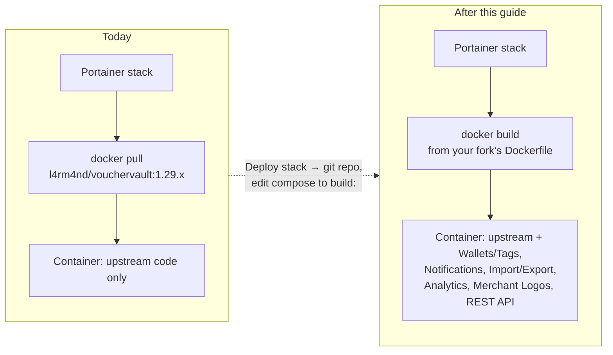
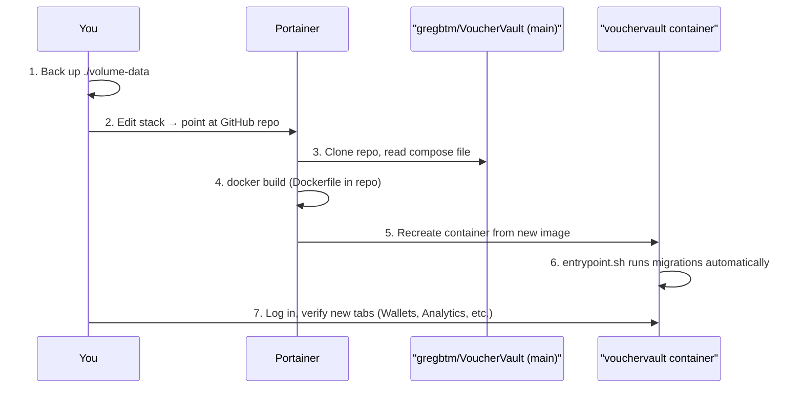

# Upgrading from the upstream image to this fork (Portainer guide)

If you deployed VoucherVault using the docs in the main `README.md`, your
stack is running the upstream image published to Docker Hub:

```
image: l4rm4nd/vouchervault:1.29.x
```

That image is built and published by the upstream maintainer's own CI —
this fork's new features (Wallets/Tags, notification rules, import/export,
the analytics dashboard, merchant logos, and the REST API) are **not** in
that image. To run this fork, Portainer needs to build the image itself
from this repository instead of pulling it from Docker Hub.

The good news: everything below runs inside the same container Docker
already gives you. There's no new service to add — Celery worker and beat
already run inside the app container's entrypoint script, so the only
change is *where the image comes from*.

## Before / after



## What you'll do, in order



## Step 1 — Back up first

This is a schema upgrade (new tables, new columns) — back up before touching
anything.

- **SQLite**: copy the whole `volume-data/database` bind-mount directory
  somewhere safe.
- **PostgreSQL**: take a `pg_dump` of your `vouchervault` database.

The new migrations are strictly additive (new tables/columns only), so a
rollback to the upstream image and your backed-up data will always work if
you change your mind.

## Step 2 — Point Portainer at this fork instead of Docker Hub

Portainer can build an image directly from a Git repository instead of
pulling a pre-built one — this is the path used here since this fork does
not publish its own Docker Hub image.

1. In Portainer, open **Stacks** → your existing `vouchervault` stack.
2. Note your current environment variables (`DOMAIN`, `SECURE_COOKIES`,
   etc.) — you'll re-enter them in step 4.
3. Either **edit the existing stack** to change its build method, or
   **remove it** and re-add it as below (removing a stack does *not* delete
   your bind-mounted `volume-data`, so your data is safe either way).
4. Create/edit the stack with:
   - **Build method**: `Repository`
   - **Repository URL**: `https://github.com/gregbtm/VoucherVault`
   - **Repository reference**: `refs/heads/main`
   - **Compose path**: `docker/docker-compose-sqlite-build.yml`
     (use `docker/docker-compose-full-build.yml` instead if you need the
     "full" variant with OIDC/Postgres/Traefik options)
5. Re-add your environment variables from step 2 in the **Environment
   variables** section of the stack editor (Portainer doesn't carry these
   over automatically when you change the build method).
6. Click **Deploy the stack**. Portainer will clone the repo, run
   `docker build` using `docker/Dockerfile`, and start the container from
   the resulting image. The first build takes a few minutes (installing
   Python dependencies); subsequent redeploys are faster due to Docker
   layer caching.

> [!TIP]
> `docker/docker-compose-sqlite-build.yml` is identical to the upstream
> `docker/docker-compose-sqlite.yml` except it adds a `build:` section (so
> Portainer builds the image from this repo's `Dockerfile` instead of
> pulling `l4rm4nd/vouchervault:1.29.x`) and documents the two new
> environment variables this fork adds (`NTFY_DEFAULT_SERVER`,
> `MERCHANT_LOGOS_ENABLED`). The original compose files are left untouched
> so anyone still using the upstream image is unaffected.

## Step 3 — Let it migrate itself

No manual migration step is needed. The container's `entrypoint.sh` already
runs `python manage.py migrate` (plus the `myapp`-specific migrate step) on
every start — this fork's new tables (`Wallet`, `Tag`, `NotificationRule`,
`NotificationLog`, `ImportJob`, `MerchantProfile`, plus new columns on
`Item`) will be created automatically the first time the new container
boots. Watch the container logs in Portainer for `[TASK] Migrating changes
to the database` followed by `[DONE]`.

## Step 4 — Verify

Log in and confirm:

- Your existing items are still there, untouched
- A new **Wallets** and **Tags** management page under the sidebar
- A new **Analytics** tab on the dashboard
- **Notifications → Rules** and **Notifications → Log** pages
- **Import/Export** page
- Item cards start showing merchant logos within a few seconds of
  creating/editing an item (fetched in the background by Celery)
- `/api/v1/docs/` serves the Swagger UI for the new REST API

## Alternative: build and push to your own registry

If you'd rather not have Portainer build from Git (e.g. you want to build
once in CI and just pull everywhere), build and tag the image yourself and
push it to any registry you control (Docker Hub under your own account,
GHCR, a self-hosted registry):

```bash
git clone https://github.com/gregbtm/VoucherVault.git
cd VoucherVault
docker build -f docker/Dockerfile -t <your-registry>/vouchervault-fork:latest .
docker push <your-registry>/vouchervault-fork:latest
```

Then point your existing `docker-compose-sqlite.yml`'s `image:` line at
`<your-registry>/vouchervault-fork:latest` instead of
`l4rm4nd/vouchervault:1.29.x`, and redeploy the stack normally in
Portainer (pull-based, no build step needed on the Portainer host).

## Rolling back

Change the stack's `image:`/build method back to
`l4rm4nd/vouchervault:1.29.x`, redeploy, and restore your backed-up
`volume-data` if you also rolled back the database. Because this fork only
adds tables/columns, the upstream image can still read a database that has
gone through this fork's migrations — the extra tables/columns are simply
unused by upstream code.
